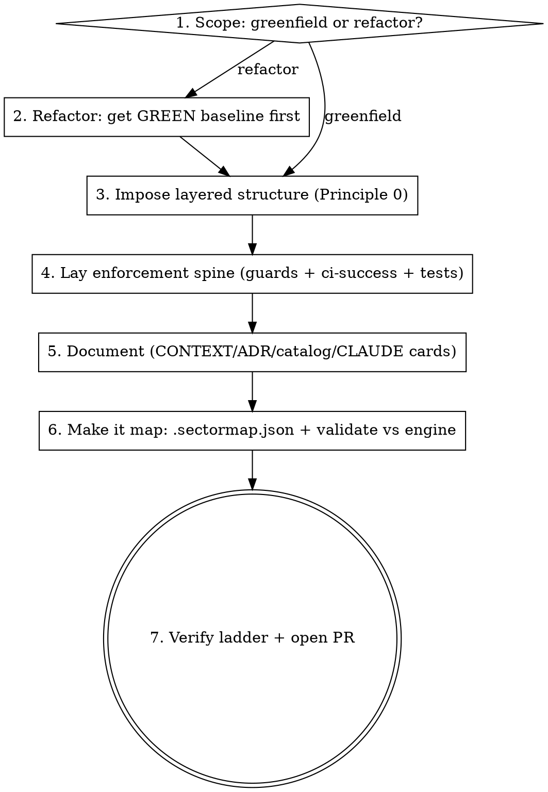

# No Bugs First

> **Step 0 — self-update (always run first).** Before doing anything else with
> this skill, run `bash <this-skill-dir>/self_update.sh`. It verifies the canonical
> upstream and server-resolved `main`, then updates only this skill's subtree, so unrelated dirty files or a
> feature-branch checkout do not freeze the global install. Genuine local or
> committed edits inside this skill still block replacement. Offline → it
> silently uses the local copy. If it reports synced changes, re-read this
> SKILL.md before proceeding. Zero local hooks or config.

`/no-new-bugs` is the **change-time** floor: every edit, don't regress. This skill is the
**design-time** floor: shape the *whole repo* so the seven know-before-you-code dimensions
are visible, the invariants are enforced as checks (not prose), and the project lands on the
**OwlSpace Map** clean — from the first commit, not retrofitted after the mess.

> **One doctrine, two entry points.** This skill does NOT restate the anti-regression rules —
> it **applies** them at repo scale. Principle 0 (couple to ONE typed/tested source of truth,
> the enemy is duplication-drift, depend on contracts not guts) and the verification ladder
> live in `no-new-bugs`. Read that skill's `SKILL.md` once; this skill is how you *instantiate*
> it in a fresh or refactored repo. When in doubt about a change *inside* the loop below, the
> sub-skill is `no-new-bugs`.

---

## When to use

- **Greenfield** — a new service, package, or app. Lay the foundation right.
- **Refactor / redesign** — an existing repo (backend or frontend) that grew tangled: god-files,
  duplicated facts, no tests, no map presence. Bring it to the same clean floor *without*
  regressing what works.

Do NOT use for a single-file fix or one feature inside an already-clean repo — that's
`no-new-bugs`. This skill earns its cost when the **whole repo's shape** is the unit of work.

---

## The non-negotiable outputs

When this skill finishes, the repo has ALL of these, or it isn't done:

1. **A layered structure** (Principle 0 made physical) — inner layers expose contracts, outer
   layers depend inward only, every fact has one home. Stack-specific layout below.
2. **`scripts/repo-guards.sh`** — the universal guard starter (the `repo-guards` skill:
   `~/.claude/lib/guards/repo-guards.sh`) + this repo's project-specific checks, **wired into CI**.
   Turns every "always/never" into a blocking grep. *If the project already has an executable
   rules-gate, wire that in instead of hand-rolling its checks* — e.g. the **KLIK-only**
   `production-rules-checker` skill IS the project layer for a KLIK Python repo (it encodes
   `nexora-policy` `policy/01` + `policy/07`: fail-fast, no-fallback, the DDD layering gates), so a
   repo scaffolded by this skill passes the hard gate from commit #1. For a non-KLIK repo, the
   universal `repo-guards.sh` + that project's own checks are the layer.
3. **A `ci-success` aggregate check** — one Woodpecker step named exactly `ci-success`, depending on
   lint + typecheck + the hermetic test lane + the guards lane, plus the canonical status bridge.
   On GitHub Free private repositories this is evidence consumed after merge by the two-minute
   `nexora-policy` ref guard; it is not a claim of pre-receive Rulesets enforcement. **Generic rule:**
   a project's coding rules have one canonical home and are referenced,
   never re-stated. *KLIK instance:* that home is `nexora-policy/policy/` (`policy/07` service layout,
   `policy/08` skills-system).
4. **A real hermetic test spine, including contract tests by default** — a failing-then-green test
   that exercises real logic at a true boundary (in-memory implementation of your own port, never
   a mock of the system under test). For KLIK, the 6-cell matrix is not aspirational: any frontend
   client/DTO/JSON mapping or backend router/wire change MUST have a contract test in the same PR,
   and those contract tests are already Grafana-visible. The floor for a new repo is one honest
   unit cell plus one honest contract cell for its first boundary; the target is all owed cells.
   If the project ships per-test telemetry, wire it so runs are **captured, not just green** (the
   emitter entry point present + reaching the dashboard). *KLIK instance:*
   `nexora-policy/policy/02-testing.md` (6-cell matrix + Test visibility) +
   `nexora-policy/rulesets/testing-coverage.yaml` + the `coverage-gate` Woodpecker step.
5. **`CONTEXT.md`** (the why / env / deploy-parity) **+ an ADR seed** (`docs/adr/0001-*.md`) **+
   a bug-catalog seed** (`bug-regression-catalog` entry or a local `catalog.yaml`).
6. **A committed `.sectormap.json`** profile + **a `CLAUDE.md` sector card per sector**, validated
   against the live Map engine so the repo renders **real DDD sectors (not the fallback) with
   contextmap findings at zero** — no cycles, no stale declared edges. This is the map-hygiene
   contract; the canonical rule + the honest-zero discipline live in `nexora-policy/policy/09-map-hygiene.md`.
   Reach zero by honest bounded-context grouping, never by merging unrelated dirs to hide a real cycle.
   *KLIK instance:* the gate is `Scripts/check_map_hygiene.sh` in `ci-success`. Where a repo also
   carries **living product docs** (PRDs), the same discipline applies to them: one canonical
   bilingual pair per context, edited in place, never versioned/duplicated — the rule lives in
   `nexora-policy/policy/10-prd-hygiene.md`, the *KLIK instance* of the gate is
   `Scripts/check_prd_hygiene.sh` in `ci-success`.
7. **A `HOW-IT-WORKS.md`** (or README section) explaining the structure so it is legible.
8. **An owner Simulation Contract seam for every applicable service** — when a new or
   refactored service owns user-visible prompts, tunable behavior, selected-user state,
   artifacts, or real side effects, it ships owner discovery/execution contracts, RED-first
   contract tests, documentation, and project-gate wiring before production admission. The
   canonical rule is `nexora-policy/policy/13-simulation-contracts.md`; do not copy owner
   prompts/defaults into a consumer or claim coverage without owner-validated evidence.

Each output is a check or an artifact — none is "we'll remember to." That is the whole point.

---

## The flow



### Step 1 — Scope
Detect greenfield (empty / near-empty) vs. refactor (existing code). Announce which, and the
detected stack (backend bun/python/go, frontend React/Electron/KMP). State your assumptions
explicitly and let the user correct before you scaffold — silently guessing the layout is the
design-time version of the most dangerous failure.

### Step 2 — Refactor only: GREEN baseline BEFORE touching anything
You do not refactor on red. Run `no-new-bugs`' verification ladder to establish a fast pass/fail
signal first: build from a clean slate, run whatever tests exist, record the result. If there is
no loop, that IS the first deliverable — write a characterization test that pins current
behavior, get it green, *then* refactor against it. `git status` first; surface foreign state,
never bundle it. Decompose god-files **along the contracts**, not by line count.

### Step 3 — Impose the layered structure (Principle 0, physical)
Pick the layout from the detected stack — see `references/layouts.md` for the concrete trees.
- **Backend (DDD)** — `src/<context>/{domain,application,infrastructure}` + thin `routers/`.
  domain = pure types, zero framework imports; application = Command+Handler depending on
  *interfaces*; infrastructure = the ONLY place ORM/SDKs appear. Reference impl: KK_auth.
- **Frontend (feature-sliced)** — `src/features/<feature>/{model,ui,api}` + `src/shared/`
  (contracts, types, the ONE client). DTOs that cross client↔server are a single typed
  contract, never two copies (duplication-drift is the enemy).
The directory invariant ("inner layer never imports outer") becomes a `repo-guards.sh` check —
a layered architecture is *grep-enforceable*, which is why it's the structure we pick.

For an applicable Owner Simulation Contract, the same ownership boundary applies: production
owners expose typed discovery/execution seams and tests; consumers depend on that contract and
never import owner runtime code, read owner databases, or maintain prompt/default copies. Route
the objective rejection through the project's hard-rules gate. KLIK's instance is
`SIMULATION_CONTRACT_REQUIRED`; its canonical policy remains
`nexora-policy/policy/13-simulation-contracts.md`.

### Step 4 — Lay the enforcement spine
- Copy `~/.claude/lib/guards/repo-guards.sh` into `scripts/`, add project checks (layer-import
  rule; "use the wrapper not the raw API"; any serialization-default landmine for your stack).
- **If the project already owns an executable rules-gate, wire it in rather than re-deriving its
  rules.** When a new objective invariant recurs, add it as a category in that gate, not as prose.
  *KLIK-only instance:* wire the `production-rules-checker` skill
  (`validate_production_rules.py --staged`) into the pre-commit hook and `ci-success` — it already
  encodes `nexora-policy` `policy/01` + `policy/07` (no fallback, no hardcode, domain purity,
  application boundary, DB-in-repos, service instrumentation, deploy parity), so on KLIK the
  hand-rolled `repo-guards.sh` layer only covers invariants not yet a category there. On a non-KLIK
  repo, `repo-guards.sh` + that repo's own checks are the whole layer.
- Add `.woodpecker/ci.yaml` with lint + typecheck + test + guards steps and terminal
  **`ci-success`** / **`ci-failure`** status steps that depend on every blocking lane. Install
  `.woodpecker/ci-success-bridge.sh` and keep the status context exact. Start from
  `templates/woodpecker-ci.yaml` and `templates/ci-success-bridge.sh`; adapt commands and images,
  not the self-hosted Woodpecker or status-posting contract.
- Write the first hermetic test (RED → GREEN). Use an in-memory implementation of your own
  interface, assert observable output. Wire a pre-push hook if the repo has no CI runner.

### Step 5 — Document the invisible dimensions
Structure is parseable; dimensions #2–#7 are not — anchor them now or the agent never sees them:
- **`CONTEXT.md`** — env/config/secrets, dev→prod differences, deploy-parity command, resource
  ownership (ports/files/singletons).
- **`docs/adr/0001-architecture.md`** — the *why* of this layout (ADR seed).
- **bug catalog** — register the project in `bug-regression-catalog/catalog.yaml` (or seed a
  local one) so recurring bugs get a `lint` regex + `observable_signal`.
- **`CLAUDE.md` per sector** — purpose, schema, dependencies, invariants. The Map auto-ingests
  these as the sector card (the KK_auth convention, generalized), so writing them is *also* what
  makes the map readable.

### Step 6 — Make it map cleanly (the load-bearing, must-verify step)
See `references/map-integration.md` for the full procedure. In short:
1. Write a committed **`.sectormap.json`** at repo root: `{label, lang, src_base, test_base,
   import_prefix, resolve, behavior, sectors:[{id, root}], ...}`. Sectors = your layers/features.
   `behavior` carries this repo's invariants (the GUARD_SIGNS) so they render on dimension #2.
   Declare `edges:[{src,dst,pattern}]` only for relationships that actually exist — they make the
   contextmap *gate* on those boundaries and catch future drift.
2. **Validate it against the live engine** — never assume it renders:
   ```bash
   python3 "$OWLSPACE_MAP_DIR/sector_map/cli.py" list --repo <REPO>        # real sectors, not fallback
   python3 "$OWLSPACE_MAP_DIR/sector_map/cli.py" contextmap --repo <REPO>  # findings must be []
   python3 "$OWLSPACE_MAP_DIR/sector_map/cli.py" brief <sector> --repo <REPO>
   ```
   Every sector must resolve; **contextmap findings must be zero** (no cycle, no stale declared
   edge); the test panel must reflect your real test files. A malformed/absent profile silently
   falls back to the default (top-level dirs) — that fallback rendering IS the failure signal; fix
   the profile until `list` shows your intended sectors and `contextmap` shows `findings: []`. Reach
   zero by honest bounded-context grouping (a true shared kernel = one sector id), **never** by
   merging unrelated dirs to hide a real cycle. This is the map-hygiene contract
   (`nexora-policy/policy/09-map-hygiene.md`); the *KLIK instance* of the gate is
   `Scripts/check_map_hygiene.sh`, wired into `ci-success`.

### Step 7 — Verify from clean + open the PR
Climb the `no-new-bugs` ladder: fresh clone/worktree → clean build → run the hermetic test →
`ci-success` green on the PR. Then open a branch + PR (never direct-push). On GitHub Free private
repos the committed ref declarations and two-minute ref guard are the compensating control; do not
pretend an unavailable org/repository Rulesets dependency pre-blocks the write. The PR body lists the seven outputs with
a checkbox each, so the reviewer sees the floor was met. Update the Unified Bitable if this is
tracked work.

---

## Refactor discipline (the extra rules beyond greenfield)

- **Characterization test first** — pin current behavior green before changing it; the test that
  passes before AND after is the proof you didn't regress.
- **Separate commits** — structure/refactor commits never mix with behavior commits. A reviewer
  must be able to read "moved code" apart from "changed code."
- **Reap the old** — when you replace a mechanism, delete what it supersedes AND the state that
  escaped (a duplicate module, a stale config value). disabled ≠ gone.
- **Don't auto-fix what you can't verify** — if part of the repo touches a prod-only/native path
  you can't run here, propose the change, don't ship it blind.

---

## What "done" means

Run the checklist, not a feeling: all outputs exist, the Woodpecker scaffold and status bridge are
present, `ci-success` is green on a fresh
clone, `cli.py brief` renders your intended sectors (not the default fallback), and the PR is
open. If any of those is missing, it is not done — say which and why, with the command output.
